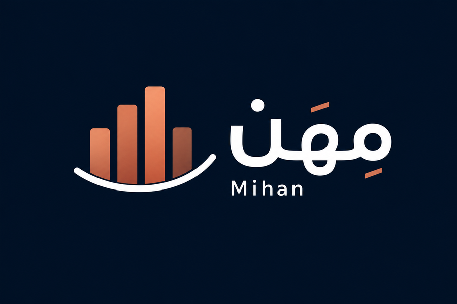
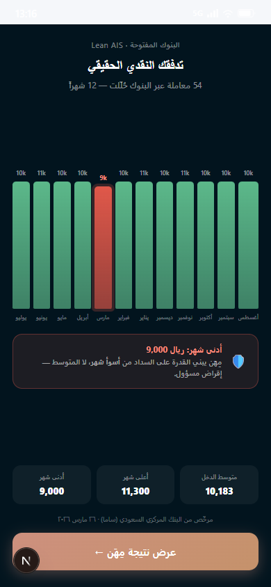
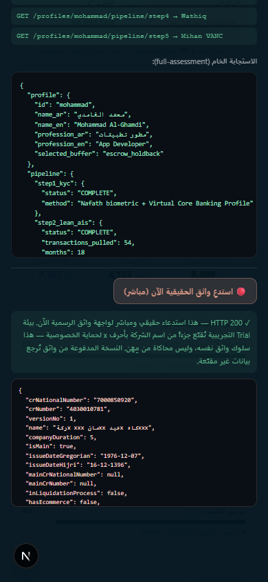
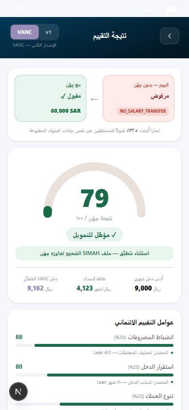
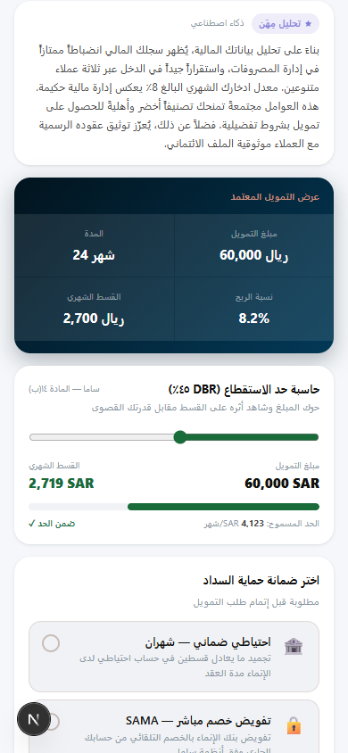
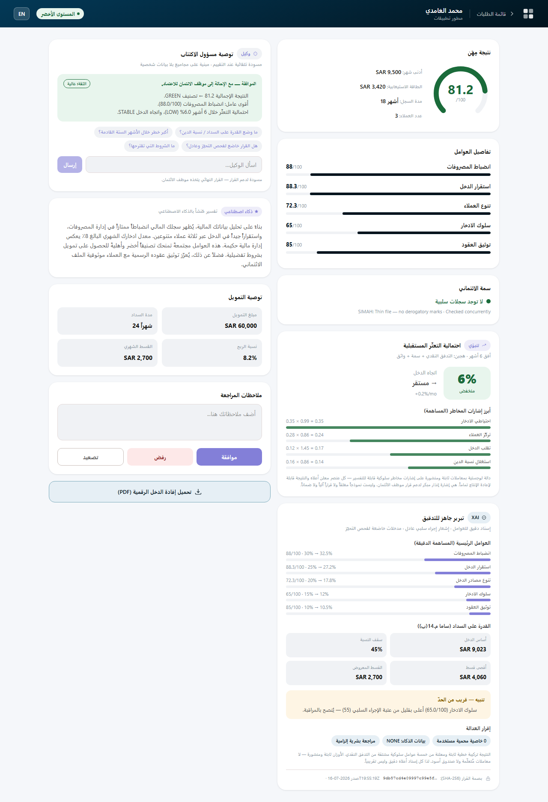
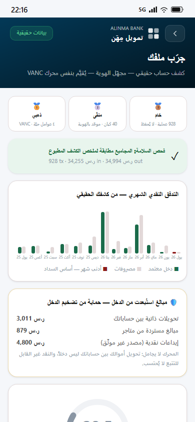
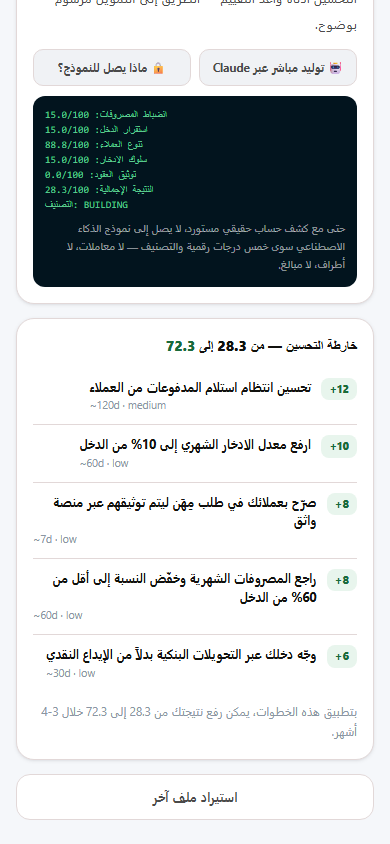

<div align="center">



# مِهَن — Mihan

**AI-powered alternative credit scoring for Saudi freelancers, embedded inside Alinma Bank.**

*Irregular income in. One verified path out.*


Built for the **AMAD 2026 Hackathon** — Alinma Bank × Tuwaiq Academy · July 16–18 · Riyadh

</div>

---

## The Problem

**Over 1.8 million active Saudi freelancers** (2.2M+ registered on the national platform) are rejected by every commercial bank:

- **SIMAH** file is empty — no credit history exists
- **Mudad** has no salary record — there is no employer

Standard rejection code: `NO_SALARY_TRANSFER`. End of conversation — until now.

## The Solution

Mihan analyzes **Open Banking transaction data** to score income *capacity* instead of employment history. It lives directly inside the Alinma app — no separate product, no new account.

The model is proven locally: **Tamara** (Saudi BNPL) achieved **+32% approval rates** for freelancers using the same Open Banking cash-flow data. On **March 27, 2026** SAMA issued its first Open Banking license — a Major Payment Institution licence to Lean Technologies — moving Open Banking from the regulatory sandbox to a licensed activity. Mihan is the first to bring this into a commercial-bank term loan.

> **SIMAH tells you if the applicant has repaid debt before. Mihan tells you if they can repay debt now.** For a freelancer with no credit history, SIMAH is silent — Mihan gives the bank a voice. (SIMAH still runs in parallel; it is never replaced.)

---

## Demo Highlights

<table>
<tr>
<td width="50%" align="center">
<br/>
<b>⭐ The cash-flow reveal</b><br/>
<sub>54 cross-bank transactions become 12 months of visible income. The <b>worst month pulses red</b> — that's the repayment-capacity basis, not the average. Responsible lending, visualized.</sub>
</td>
<td width="50%" align="center">
<br/>
<b>⭐ Live Wathq API proof</b><br/>
<sub>One tap fires a <b>real HTTP call to the official Wathq gateway</b> (<code>api.wathq.sa</code>) and shows the raw response on screen. Not a mockup — provable on stage.</sub>
</td>
</tr>
<tr>
<td align="center">
<br/>
<b>Before / after in one frame</b><br/>
<sub>Same freelancer: rejected today (<code>NO_SALARY_TRANSFER</code>) → approved with Mihan (SAR 60,000). Tamara's +32% stat stamped underneath.</sub>
</td>
<td align="center">
<br/>
<b>Interactive DBR 45% guardrail</b><br/>
<sub>Drag the loan amount and watch the installment recompute live — it turns red the moment it breaches SAMA's 45% cap (Article 14(b)).</sub>
</td>
</tr>
</table>

<div align="center">
<br/>
<b>The credit officer dashboard</b> — full factor breakdown, SIMAH exception banner, Wathq verification, income trend, and a human decision row. <b>No loan is ever auto-approved.</b>
</div>

<table>
<tr>
<td width="50%" align="center">
<br/>
<b>⭐ جرّب ملفك — a REAL statement, not a simulation</b><br/>
<sub>A consented, <b>anonymized real bank statement (928 transactions)</b> scored through the same VANC engine. Parsed totals match the statement's printed summary to the halala, and <b>SAR 8,690 of self-transfers, cash deposits, and refunds are excluded from income</b> — the engine doesn't flatter real data.</sub>
</td>
<td width="50%" align="center">
<br/>
<b>⭐ Zero-PII AI + evidence-grounded roadmap</b><br/>
<sub>The literal payload reaching Claude: <b>five scores and a tier — none of the 928 transactions</b>. Below it, an improvement roadmap derived from the statement itself: 28.3 → 72.3 projected, including "route income through transfers — your SAR 4,800 in cash deposits couldn't count."</sub>
</td>
</tr>
</table>

*All 21 walkthrough screenshots live in [`demo_screenshots/`](demo_screenshots/).*

---

## Demo Flow

The demo runs as a mobile-first phone simulation in the browser. Walk through it in order:

| # | Screen | What happens |
|---|--------|--------------|
| 1 | **Rejection Wall** (`/`) | A realistic Alinma loan form → `NO_SALARY_TRANSFER` → pivot card offering the Mihan path |
| 2 | **Profile Selector** (`/demo`) | Choose one of three personas (below) — or take the **«جرّب ملفك»** card to `/import` and score a **real anonymized statement** (step 5–8 equivalents, computed from 928 real transactions) |
| 3 | **Onboarding** | Lean Open Banking consent → Nafath biometric face-scan → Virtual Core Banking Profile (Tech-IBAN) |
| 4 | **Live Pipeline Scan** | Five sequential real API calls, each visible in DevTools → Network |
| 5 | **⭐ Cash-Flow Reveal** | Monthly income bars animate in from real `step2` data; worst month highlighted as the lending basis |
| 6 | **Score Result** | Animated gauge, before/after card, 5-factor breakdown with per-factor **data-provenance labels**, VANC/v1 toggle, loan offer, DBR calculator, buffer selection, PDF download |
| 7 | **⭐ Behind the Scenes** | Floating `</>` button overlays the raw `full-assessment` JSON + a **live Wathq call button** — proof nothing is hardcoded |
| 8 | **Officer Dashboard** | Full credit-officer view with Claude-generated Arabic explanation and Approve / Decline / Human-Review actions |

### The three personas

| Persona | Profession | Tier | Outcome |
|---|---|---|---|
| **محمد الغامدي** (Mohammad) | App developer — 3 clients | 🟢 Green | SAR 60,000 · 24 mo · 8.2% APR |
| **نورة العمري** (Noura) | Graphic designer — 2 clients | 🟡 Yellow | SAR 25,000 · 18 mo · 11.5% APR |
| **فهد القحطاني** (Fahad) | Photographer — 1 client (shell-company risk flag) | 🔴 Building | No loan — improvement roadmap |

### The pipeline

| Step | Integration | What happens |
|---|---|---|
| 🪪 1 — KYC | Nafath | Biometric identity + Virtual Core Banking Profile |
| 🏦 2 — Lean AIS | Open Banking | 18 months of cross-bank transactions pulled; monthly buckets computed |
| 📋 3 — SIMAH | Credit bureau | Thin file detected — expected for freelancers, **not** a negative signal |
| ✅ 4 — Wathq | Ministry of Commerce | Declared client companies verified against the CR registry |
| ⚡ 5 — Mihan Engine | VANC model | Composite score + tier + complete loan recommendation |

---

## Live vs. Simulated — the honest breakdown

| Source | Status | Detail |
|---|---|---|
| **Wathq** | 🟢 **LIVE** | Real client (`backend/wathq_api.py`) against the official gateway, `apiKey` auth, confirmed HTTP 200. The `/wathq-live-proof` endpoint fires an on-demand real call, shown in-app. |
| **Lean AIS** | 🔵 Simulated (demo) | Deterministic synthetic transactions **in the demo only**. The rail itself is live: Lean Technologies is the **first SAMA-licensed Open Banking provider** (Major Payment Institution licence, March 27, 2026), and the AIS rail Mihan uses has graduated from SAMA's regulatory sandbox to a **licensed activity**. The remaining gate is **commercial, not regulatory** — a signed agreement between a licensed AIS provider and the partner bank (Alinma's commercial sign-off) — after which the same engine runs on production data. |
| **SIMAH** | 🔵 Simulated | Bureau access is restricted to licensed financial institutions with a SIMAH membership — only Alinma itself can hold this. |
| **Nafath** | 🔵 Simulated | Requires a TCC license — a formal government authorization, not an open API. |

**The real-statement importer closes the gap:** the technological and regulatory
framework is completely live today — the only thing standing between the demo and
production Lean AIS is a **commercial** bank-agent agreement, not a regulatory
clearance. To bridge that commercial gap, Mihan also ships an importer that takes a
*real, consented* bank statement instead, converting simulated demo data into a
direct production roadmap the moment commercial onboarding completes. `backend/statement_pdf.py` parses the standard Saudi retail
statement PDF and anonymizes it **at ingestion** — holder name, accounts, cards,
and payment refs are stripped before any transaction object exists; income senders
survive only as deterministic pseudonyms, and a fail-closed PII scan blocks the
import if anything identifying leaks through. `POST /import-statement` then runs
the anonymized cash flow through the exact same VANC engine, computing **four of
the five factors live** (a real statement has both sides of the ledger, so expense
discipline and savings behavior are derived too, not declared). Self-transfers,
ATM cash deposits, and refunds are detected and excluded from income — the
anti-income-inflation control — and parsed totals are checked against the
statement's own printed summary.

The importer is a **medallion pipeline** — bronze (raw parse, in-memory only,
never persisted) → silver (anonymization + **entity resolution**: narration
variants and multi-rail payments of the same counterparty collapse into one
entity, so 30 payments from the same platform via two banks count as ONE client,
and a spelling-variant self-transfer can't sneak into income) → gold (factor
derivation + scoring). Deliberately deterministic, and tuned by *risk direction*:
counterparties are keyed on their full name-token set (legal-form suffixes like
CO/LLC/EST dropped, but distinguishing words like TRADING/HOLDING kept) so two
different clients who merely share a first name are **never** silently merged into
one — which would misstate diversity. Self-transfer detection is separately made
*lossy* (consonant-skeleton matching) so transliteration and spacing variants of
the account holder's own name are still caught and excluded from income. Arabic
sender names are Unicode-folded so they resolve as real entities, not dropped. The
AI model stays outside ingestion entirely.

**Why the demo narrative still uses simulated Wathq data:** the Trial-tier sandbox returns a single fixed record with the company name privacy-masked (literal `x` characters) for *any* CR number — it does not do real per-CR lookups. So the persona storyline keeps clean simulated names, while the **"خلف الكواليس"** panel proves the live integration honestly, masking and all. All four sources share the same `try-real-then-fallback` architecture, so each one is a drop-in replacement once its access path opens — **commercial** for Lean (the SAMA-licensed rail is already live), and licensing for SIMAH/Nafath.

---

## Scoring Model

### Factors & weights

| Factor | Weight | What it measures | Data source |
|---|---|---|---|
| Expense Discipline | 30% | Expense-to-income ratio, spending consistency | Lean AIS transaction classification |
| Income Stability | 25% | Month-over-month income variance | ⚡ **Computed live**: CV over a zero-filled 18-month window |
| Client Diversity | 20% | HHI concentration across income sources | ⚡ **Computed live**: HHI over income senders |
| Savings Behavior | 15% | Consistent positive end-of-month balance | Lean AIS balance history |
| Contract Verification | 10% | Active, verified CRs for declared clients | **Wathq** — Ministry of Commerce |

### Tiers

| Tier | Composite | Offer |
|---|---|---|
| 🟢 Green | ≥ 75 | SAR 60,000 · 24 months · 8.2% APR |
| 🟡 Yellow | 55–74 | SAR 25,000 · 18 months · 11.5% APR |
| 🔴 Building | < 55 | No loan — score-improvement roadmap |

Two engine versions are demo-toggleable: **v1** (Phase 1 rule-based) and **v2 — VANC** (Volatility-Adjusted Net Cash flow).

The ⚡ factors are recomputed from the transaction data on every request — income gaps count as zero-income months (they inflate volatility instead of hiding in the average), and each factor carries a provenance label. `GET /profiles/{id}/factor-analysis` exposes the full working: CV, HHI, income shares, and the monthly buckets. The "خلف الكواليس" panel shows it on demand.

---

## Decision Intelligence & Risk Assessment

The composite score is just the base. Three deterministic layers sit on top of it — all reusing the same score/factor evidence, none introducing a new PII surface — to turn a number into an *auditable, forward-looking, defensible* credit decision. They surface together on the **officer dashboard** (`/banker/[id]`).

### ⚖️ Regulatory Explainability (XAI) — auditor-ready justification

`backend/regulatory_xai.py` · `GET /profiles/{id}/regulatory-explainability` (also embedded in `/import-statement`)

Because the Mihan score is a **fixed, published linear model** (composite = Σ weightᵢ × scoreᵢ), its explanations are *exact* — not SHAP/LIME approximations of a black box. The record carries:

- **Exact principal-factor decomposition** — each factor's precise contribution to the composite, ranked.
- **Fair-lending adverse-action notice** — specific principal reason codes whenever a loan is declined or the offer is DBR-compressed.
- **Margin of transparency** — a `cautionary` block so *approved-but-borderline* files still get an explanation: `WATCH_<factor>` codes for factors drifting toward the adverse threshold (55 < score ≤ 65), and a `MARGINAL_APPROVAL` note when the composite clears the 55 financing line by fewer than 5 points. (Closes the "silent at 55.1" gap.)
- **Input-level fairness attestation** — no protected attribute (gender, nationality, age, tribe/family name, marital status, region) enters the score *or* the AI payload. Deliberately scoped as an input-level attestation, **not** a statistical disparate-impact audit.
- **Tamper-evident decision hash** — a deterministic **SHA-256 `content_hash`** reproducible from the score alone, stamped at decision time with `issued_at` + `record_hash` into the append-only audit ledger. An auditor recomputes the hash from the score and matches the ledger entry. (Tamper-evident ledger + deterministic hash — *not* an immutable/blockchain claim.)

### 🔮 Predictive Behavioral Intelligence — forward-looking default probability

`backend/predictive.py` · `GET /profiles/{id}/forward-outlook` (also embedded in `/import-statement`)

A **6-month forward default probability** — a *transparent* logistic with **published, fixed coefficients** over six interpretable [0,1] risk signals: income volatility, income-**trend slope** (deterioration), client concentration, savings buffer, DBR utilisation, and a Wathq registry flag. It fuses live cash-flow dynamics with **SIMAH file status + Wathq registry** ("Hybrid Analysis"), so the view is an early-warning signal rather than a static snapshot. Every term is returned decomposed and reproducible. Honestly labelled as **decision-support**, not a trained PD model and not a guarantee. (Personas: ~6% LOW / ~29% ELEVATED / ~45% HIGH.)

### 🤖 Autonomous Underwriting Agent — recommend & defend

`backend/underwriting_agent.py` · `GET /profiles/{id}/underwriter-recommendation` + `POST /agent/ask`

- **Auto-drafts** a decisive underwriter recommendation the moment an assessment exists — action, rationale, risk-appropriate conditions (escrow holdback, income routing, quarterly re-underwrite), and a confidence level.
- **Grounded multi-intent chat** the officer can interrogate: a question touching both affordability and forward risk composes an answer from **both** sources; a `what_if` handler fields curveballs directionally (no invented numbers). It can also explain the **VANC volatility haircut** — the μ, σ, and the μ − 1.5σ gap behind a conservative income-stability penalty.
- **Zero-PII by construction** — the agent only ever sees a clean aggregate (scores, DBR math, forward signals, adverse codes); `assert_context_clean()` fail-closes on any raw-data leak, and the opt-in live-Claude path gets the *same* aggregate.

---

## Regulatory Design

- **DBR cap — 45%** of total monthly income (SAMA Responsible Lending Principles, Article 14(b)). The 33.33% cap applies only to employer salary deductions — not freelancer income-based financing.
- **Worst-month basis** — repayment capacity is computed from the applicant's *lowest* income month, not the average. Deliberately more conservative than income averaging.
- **SIMAH exception sandbox** — thin SIMAH file + Mihan Score ≥ 75 bypasses the auto-reject and routes to a credit officer with the full decision package.
- **AI explainability** — every scoring event is written to the SAMA audit log with its full factor breakdown; a plain-Arabic explanation (Claude-generated) accompanies every decision; human review is always one tap away.
- **Auditor-ready adverse action** — declines and DBR-compressed offers carry a fair-lending notice with specific principal reason codes; borderline approvals carry a cautionary margin-of-transparency block (see [Decision Intelligence](#decision-intelligence--risk-assessment)).
- **Input-level fairness** — no protected attribute enters the score or the AI payload; the model is a fixed, published linear model, so every attribution is exact.
- **Tamper-evident audit** — each decision record carries a deterministic SHA-256 hash bound to its issue time in the append-only audit ledger, so the exact justification an officer saw is reproducible and verifiable after the fact.
- **Cash Flow History Statement** — the downloadable PDF is deliberately *not* named "Proof of Income" (a legally distinct document that would create issuer liability). It contains no credit score and no SIMAH data.
- **No auto-approval** — every loan decision routes through the officer dashboard.

### 📚 The regulatory homework

None of the above is guesswork — the full research is in the repo:

| Document | What it covers |
|---|---|
| [Research Brief v6](docs/research/Mihan_Research_Brief_v6.pdf) | Market sizing (48 verified sources), scoring methodology, revenue model, competitive analysis, anticipated judge objections |
| [Final Regulatory Clearance](docs/research/Mihan_Final_Regulatory_Clearance.pdf) | Feature-by-feature verdict on what is deployable **today** under Alinma's existing license vs. what needs SAMA approval, and the exact path for each |
| [Full Assessment Report](docs/research/Mihan_Full_Assessment_Report.pdf) | Sample generated end-to-end assessment output |

---

## Quick Start

### Prerequisites

- Python 3.10+ · Node.js 18+ (or just Docker — see Option C)
- `pip install -r backend/requirements.txt`
- `cd frontend && npm install`

### Option A — one command (Windows)

```powershell
.\start.ps1
```

### Option B — manual (any OS)

```bash
# Terminal 1 — backend
cd backend
python -m uvicorn main:app --reload --port 9000

# Terminal 2 — frontend
cd frontend
npm run dev
```

### Option C — Docker (any OS, no Python/Node needed)

```bash
docker compose up --build
```

Builds and starts both services (frontend production build + backend). The Wathq credentials in `backend/.env` are picked up automatically if the file exists — without it the live-proof button falls back to simulation, same as running natively. The SQLite audit log lives inside the container, so it resets on rebuild (fine for the demo).

| Service | URL |
|---|---|
| Demo app | http://localhost:3000 |
| Backend API | http://localhost:9000 |
| Interactive API docs | http://localhost:9000/docs |
| Health check | http://localhost:9000/health |
| SAMA audit log | http://localhost:9000/audit-log |
| **Wathq live proof** | http://localhost:9000/wathq-live-proof |

### ⚠️ Before demo day — `backend/.env` is required for the live Wathq proof

`backend/.env` is **gitignored** (it holds a real developer.wathq.sa API key) and will not exist on a fresh clone. Without it the live Wathq button silently falls back to simulation — the demo still works, but you lose the live-proof moment.

```env
ALLOWED_ORIGINS=http://localhost:3000,http://127.0.0.1:3000
WATHQ_CONSUMER_KEY=<your developer.wathq.sa consumer key>
WATHQ_CONSUMER_SECRET=<your developer.wathq.sa consumer secret>
WATHQ_BASE_URL=https://api.wathq.sa/sandbox/commercial-registration
```

Restart the backend, then verify with `curl http://localhost:9000/wathq-live-proof` — `"live": true` means you're good **before** you're on stage.

---

## API Reference

Base URL: `http://localhost:9000`

| Method | Path | Purpose |
|---|---|---|
| GET | `/health` | Deployment health check |
| GET | `/profiles` | List the 3 demo personas |
| GET | `/profiles/{id}/score?version=v1\|v2` | Mihan score (Phase 1 or VANC) |
| GET | `/profiles/{id}/explanation?lang=ar\|en` | Claude-generated explanation |
| GET | `/profiles/{id}/lean-transactions` | Lean AIS transaction history |
| GET | `/profiles/{id}/wathq` | Wathq client verification (live-first, simulated fallback) |
| GET | `/profiles/{id}/factor-analysis` | **Live factor derivation** — CV + HHI recomputed from transactions, with evidence |
| GET | `/profiles/{id}/ai-privacy-proof` | **AI privacy proof** — the literal payload sent to Claude (anonymized scores only, zero PII) |
| GET | `/profiles/{id}/regulatory-explainability` | **Auditor-ready XAI** — exact factor attribution, DBR arithmetic, fair-lending adverse-action notice, input-level fairness attestation |
| GET | `/profiles/{id}/forward-outlook` | **Forward-looking default probability** (6-mo) — transparent logistic over hybrid cash-flow + SIMAH + Wathq signals, fully decomposed |
| GET | `/profiles/{id}/underwriter-recommendation` | **Autonomous underwriter** — auto-drafted recommendation, rationale, conditions, confidence (zero-PII aggregate) |
| POST | `/agent/ask` | **Underwriter agent chat** — grounded Q&A over the zero-PII aggregate (`{profile_id, question, live_ai}`) |
| GET | `/wathq-live-proof?cr=` | **On-demand real call to the live Wathq API** — raw response + call metadata |
| POST | `/import-statement?live_ai=` | **Real-statement importer** — score a consented, pre-anonymized real bank statement through the same VANC pipeline (4 of 5 factors computed live), with an evidence-grounded improvement roadmap and a zero-PII AI explanation (`live_ai=true` tries Claude live, template fallback). Frontend: **`/import` — «جرّب ملفك»** |
| GET | `/profiles/{id}/simah` | SIMAH thin-file report |
| GET | `/profiles/{id}/roadmap` | Score-improvement plan |
| GET | `/profiles/{id}/pipeline/step1…step5` | The five pipeline stages (KYC → Lean → SIMAH → Wathq → scoring) |
| GET | `/profiles/{id}/full-assessment` | Complete pipeline snapshot |
| GET | `/profiles/{id}/proof-of-income` | Cash Flow History Statement (PDF) |
| POST | `/profiles/{id}/human-review` | Request credit-officer review / log buffer selection |
| POST | `/rejection-check` | Before-Mihan rejection simulation |
| GET | `/audit-log` | SAMA explainability audit trail |

---

## Tech Stack

| Layer | Technology |
|---|---|
| Backend | FastAPI (Python) · SQLite audit log · fpdf2 PDF (Arabic RTL + QR) |
| Frontend | Next.js 16 App Router · React 19 · Tailwind CSS 4 · Framer Motion |
| Scoring | Custom VANC engine (Volatility-Adjusted Net Cash flow) |
| Company verification | **Wathq — Ministry of Commerce (live API)** |
| Open Banking | Lean Technologies AIS (first SAMA-licensed Open Banking rail, Mar 2026; live — gate is commercial not regulatory; simulated in demo) |
| KYC / Bureau | Nafath · SIMAH (simulated; license-gated) |
| AI explanations | Claude (Anthropic) — Arabic + English |

---

## Project Structure

```
/
├── backend/
│   ├── main.py                 # All API endpoints (incl. /wathq-live-proof)
│   ├── scoring.py              # 5-factor engine: Phase 1 + VANC
│   ├── factor_analysis.py      # ⚡ Live factor derivation from transactions (CV + HHI)
│   ├── statement_import.py     # 📄 Real-statement scoring: 4 live factors, entity resolution, PII fail-closed scan
│   ├── statement_pdf.py        # 📄 Offline PDF parser/anonymizer CLI — medallion bronze→silver→gold (PII stripped at ingestion)
│   ├── statement_explain.py    # 📄 Import explanation: zero-PII payload, live-Claude-or-template
│   ├── regulatory_xai.py       # ⚖️ Auditor-ready justification: exact factor attribution, adverse-action, fairness attestation
│   ├── predictive.py           # 🔮 Forward-looking 6-month default probability (transparent logistic, hybrid signals)
│   ├── underwriting_agent.py   # 🤖 Autonomous underwriter: auto-draft recommendation + grounded chat (zero-PII aggregate)
│   ├── ai_privacy.py           # 🔒 Zero-PII payload builder for AI explanations (test-enforced)
│   ├── wathq_api.py            # 🟢 LIVE Wathq client — real gateway, graceful fallback
│   ├── wathq_simulation.py     # Curated fallback data (live-first via wathq_api)
│   ├── lean_simulation.py      # Deterministic Lean AIS transactions
│   ├── simah_simulation.py     # SIMAH thin-file simulation
│   ├── models.py · profiles.py · database.py · pdf_gen.py
│   ├── improvement_roadmap.py · explanations.json · generate_cache.py
│   ├── tests/                  # 132 pytest cases — tiers, DBR, VANC, factor derivation, PII exclusion, statement import + entity resolution + explanation, regulatory XAI, forward-outlook, underwriting agent (incl. Arabic-chip parity)
│   ├── requirements.txt · Dockerfile
│   └── .env                    # (gitignored) Wathq API credentials — see Quick Start
├── frontend/
│   ├── app/
│   │   ├── page.tsx            # /      — rejection simulator
│   │   ├── demo/               # /demo  — personas + full demo flow
│   │   ├── apply/ · banker/ · mihan/
│   │   └── globals.css         # Alinma brand tokens
│   ├── components/             # Shared UI
│   ├── lib/                    # config · types · typed API helpers
│   └── Dockerfile              # Multi-stage Next.js standalone build
├── demo_screenshots/           # Full 21-shot walkthrough incl. the /import flow (used above)
├── docs/
│   ├── assets/                 # Brand assets (logo)
│   ├── pitch/                  # Deck outline · competitive landscape · unit economics ·
│   │                           #   screenshots/ · backup video + import-flow video (.webm)
│   └── research/               # Research brief · regulatory clearance · sample report (PDF)
├── docker-compose.yml          # One-command Docker startup (both services)
└── start.ps1                   # One-command Windows startup
```

---

<div align="center">
<sub>مِهَن — لأن دخلك الحقيقي يستحق أن يُقرأ · Built with regulatory homework, not just code.</sub>
</div>
